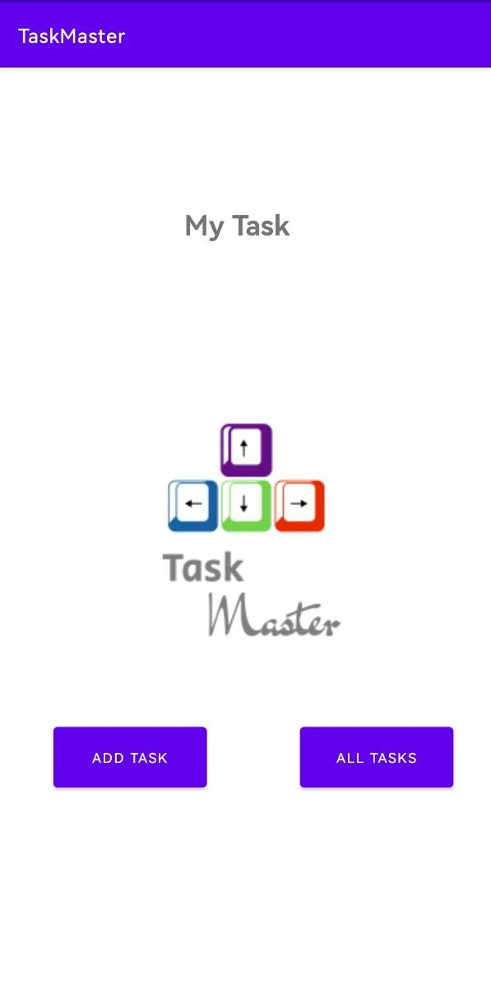
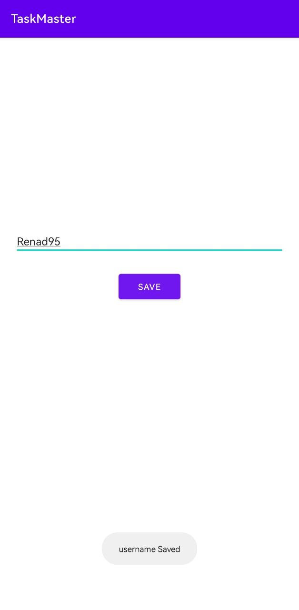
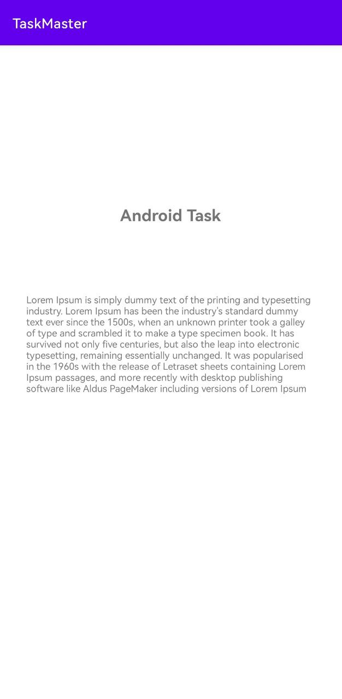
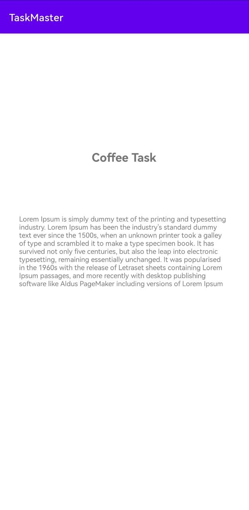
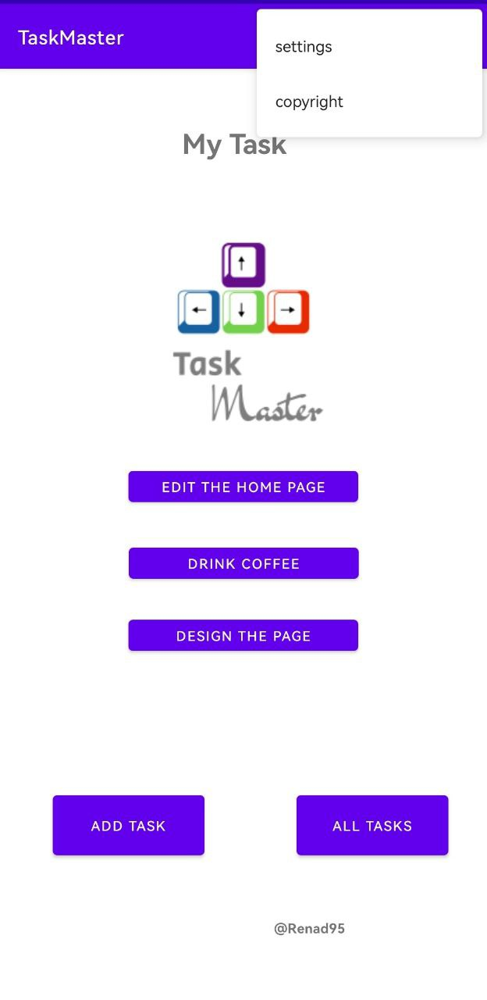
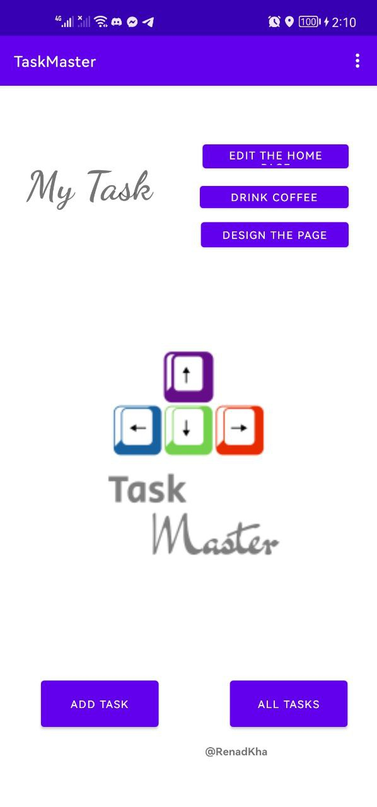
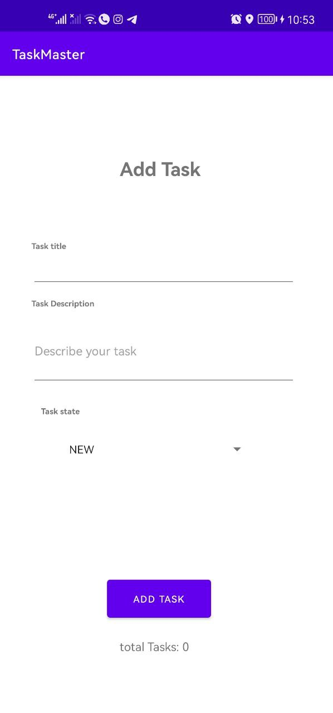
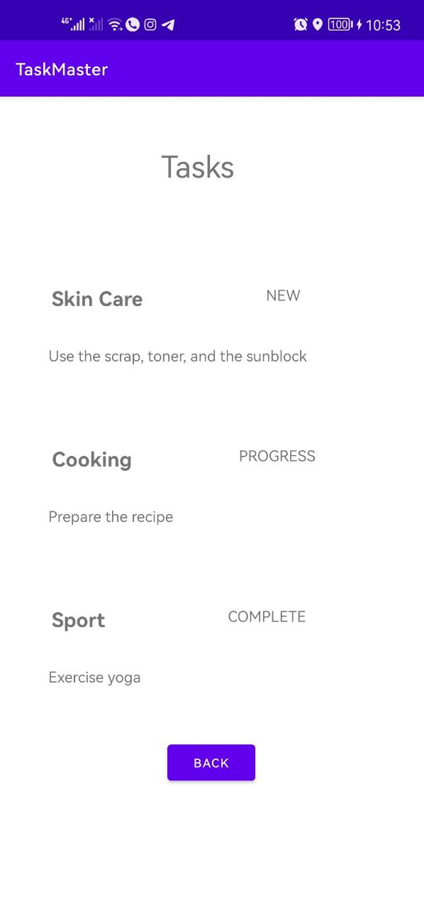

# Task Master

## What we do today?

We create three activity: one for the main page to show image with two buttuon one of them for add task and the other one to show all of the tasks. Also, we create an add task activity which allow to us to enter our tasks and the last activity to show all the tasks that user added and We will add the functionality of them later. 

## screenshot

- The main Activity  

- Activity to add tasks

- Activity to show all of the tasks

## Lab - 27

- The following function is handled:

1. Setting Page: to add a username and save it using sharedPreferences.

2. Details Page: to show data (hard coded until now) from the home page

3. add a navigation bar in the top bar.
4. show the user name inside the home page

## Lab - 29

The database saved the new task with the state of this task and the description.

