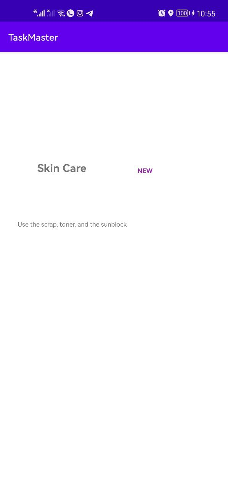

# Task Master

## What we do today?

We create three activity: one for the main page to show image with two buttuon one of them for add task and the other one to show all of the tasks. Also, we create an add task activity which allow to us to enter our tasks and the last activity to show all the tasks that user added and We will add the functionality of them later. 

## screenshot

- The main Activity  

- Activity to add tasks

- Activity to show all of the tasks

## Lab - 27

---
- The following function is handled:

1. Setting Page: to add a username and save it using sharedPreferences.

2. Details Page: to show data (hard coded until now) from the home page

3. add a navigation bar in the top bar.
4. show the user name inside the home page

## Lab - 29

----

The database saved the new task with the state of this task and the description.

## Lab - 31

---
Espresso Testing Unit was added 

Editing UserName is showed below:

Check the Important UI Element and the navigation from the HomePage to Task Details

## Lab - 32

---

1. Amplify added to application
2. Amplify client created in Application class
3. Data is posted and displayed based on DynamoDB status, not local DB status

**HomePage:**

**All Tasks:**

**TaskDetails:**

## Lab - 33

---

1. Team entity added with a reasonable structure
2. Add a team then associate teams with tasks
3. pt Show only the selected team’s tasks on homepage

**Home Page When We Start Application :**

**Select TEAM:**

**After Selected TEAM:**

**Add Team Selected To AddTask Page:**

## Lab - 34

---
We created Final AAB and add it to the root.

> To share our Application on Google we need to:

1. open Google console then create a new app
2. choose the name and these stuff then accept the developer policies and US export laws, then click on create App

3. go to set up your app and notify them about your application's content like: app access, Ads, content rating, target audience, and so on
4. then set up your store listing
5. after that create new release and upload the abb or apk
6. add some release notes then click on review release
7. click on start rollout to Production
8. the application is sent to review after the approval the app will be live on google play store

## Lab - 36

---

1. AddingCognito added with sign up page

2. Adding sign up verification page

3. Create login page

4. Add Logout functionality

5. AWS

## Lab - 37

---
Uploads
On the “Add a Task” activity, allow users to optionally select an image to attach to that task. If a user attaches an image to a task, that image should be uploaded to S3, and associated with that task.

**AWS Side**

Displaying Files
On the Task detail activity, if there is a file that is an image associated with a particular Task, that image should be displayed within that activity.

## Lab - 38

---

1. Add an intent filter to your application such that a user can hit the “share” button on an image in another application, choose TaskMaster as the app to share that image with,

2. Take the image directly to the Add a Task activity with that image pre-selected

  

## Lab - 39

---

Adding permission to the project get the coordinates to the user when we add a new task save the coordinate and push them to AWS DynamoDB

## Lab - 41

---

1. Add analytics event to your app
open aws dashboard using:

> amplify console analytics

2. Add a button to read and translate the task description

