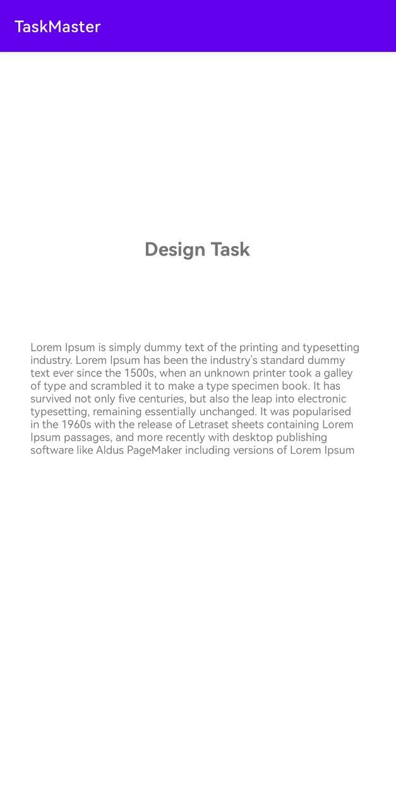
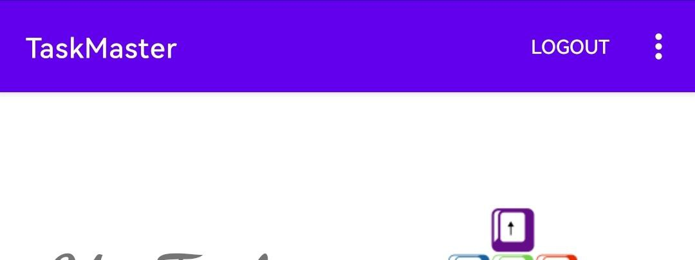

# Task Master

## What we do today?

We create three activity: one for the main page to show image with two buttuon one of them for add task and the other one to show all of the tasks. Also, we create an add task activity which allow to us to enter our tasks and the last activity to show all the tasks that user added and We will add the functionality of them later. 

## screenshot

- The main Activity  

- Activity to add tasks

- Activity to show all of the tasks

## Lab - 27

---
- The following function is handled:

1. Setting Page: to add a username and save it using sharedPreferences.

2. Details Page: to show data (hard coded until now) from the home page

3. add a navigation bar in the top bar.
4. show the user name inside the home page

## Lab - 29

----

The database saved the new task with the state of this task and the description.

## Lab - 31

---
Espresso Testing Unit was added 

Editing UserName is showed below:

Check the Important UI Element and the navigation from the HomePage to Task Details

## Lab - 32

---

1. Amplify added to application
2. Amplify client created in Application class
3. Data is posted and displayed based on DynamoDB status, not local DB status

**HomePage:**

**All Tasks:**

**TaskDetails:**

## Lab - 33

---

1. Team entity added with a reasonable structure
2. Add a team then associate teams with tasks
3. pt Show only the selected team’s tasks on homepage

**Home Page When We Start Application :**

**Select TEAM:**

**After Selected TEAM:**

**Add Team Selected To AddTask Page:**

## Lab - 36

1. AddingCognito added with sign up page

2. Adding sign up verification page

3. Create login page

4. Add Logout functionality

5. AWS 
